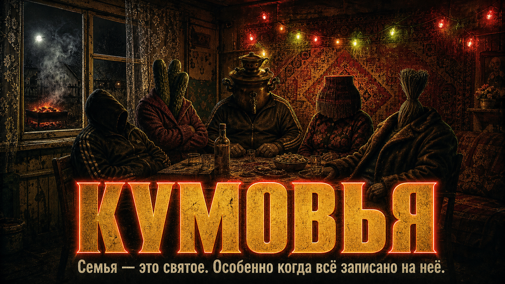

# Кумовья



> Семья — это святое. Особенно когда всё записано на неё.

Семейно-экономический кликкер с чёрным юмором: дави на связи, копи авторитет и строй империю сомнительных знакомств. Персонажи и ситуации — художественная сатира.

## Что внутри

- Пять персонажей с собственными способностями и сгенерированными иллюстрациями.
- Шесть улучшений: от огурцов без паспорта до кота-крыши.
- Пассивный доход, случайные события и рост от случайного гостя до легенды семейного чата.
- Управление касанием, мышью или клавиатурой; переключаемый звук.
- Мобильная вёрстка и подготовка к запуску в Telegram.

## Семейный состав

| Персонаж | Роль | Особенность | Открывается при |
| --- | --- | --- | --- |
| Кум Валера | Решала у мангала | Усиленные клики | Сразу |
| Кума Виктория | Тамада судного дня | Каждый 12-й клик ×8 | 150 авторитета |
| Тётя Сара | Админ семейного чата | Пассивный доход +45%, события чаще | 600 авторитета |
| Кум Гоша | Гаражный экономист | Улучшения дешевле на 20% | 2 200 авторитета |
| Тётя Зина | Нотариус последней надежды | Бонусы событий ×2,5 | 9 000 авторитета |

Персонажи открываются по общему заработанному авторитету: покупки не отодвигают их открытие.

## Статус запуска

Код и все игровые иллюстрации сохранены в этом репозитории. Публичная публикация игры и подключение к Telegram-боту пока не выполнены.

## Запуск

Требуется Node.js 22.13+.

```sh
npm ci
npm run dev
```

Сборка: `npm run build`. Проверка типов: `npx tsc --noEmit`.

Проект использует React, Vinext/Vite и OpenAI Sites. Существующая привязка хостинга хранится в `.openai/hosting.json`; секретов в ней нет. Повторно создавать сайт не нужно.

## Telegram Mini App

Игра подключает официальный Telegram SDK, сообщает о готовности, раскрывает окно и учитывает безопасные отступы. Она также работает в обычном браузере. Никакой токен бота во frontend не требуется.

1. Опубликуйте приложение и получите публичный HTTPS-адрес самой игры. Адрес репозитория GitHub для этого не подходит.
2. В [BotFather](https://t.me/BotFather) выберите своего бота через `/mybots`, включите Main Mini App в настройках и укажите адрес игры.
3. Через `/setmenubutton` добавьте кнопку «Играть» с тем же адресом.
4. После настройки Main Mini App запуск доступен по ссылке `https://t.me/USERNAME_БОТА?startapp`.

[Официальная инструкция Telegram](https://core.telegram.org/bots/webapps#launching-the-main-mini-app).

## Сохранения и безопасность

- Прогресс хранится только в localStorage этого браузера/устройства, без синхронизации между устройствами и аккаунтами.
- Если устройство блокирует сохранения, игра предупреждает об этом и продолжает работу до закрытия окна.
- Токены ботов, ключи, исходные фотографии, `.env` и личные данные не следует добавлять в GitHub.
- В репозитории находятся только готовые игровые иллюстрации, без исходных фотографий.
- Серверных рейтингов, платежей и проверки аккаунтов пока нет. Для них требуется отдельная серверная реализация с проверкой Telegram `initData`.
